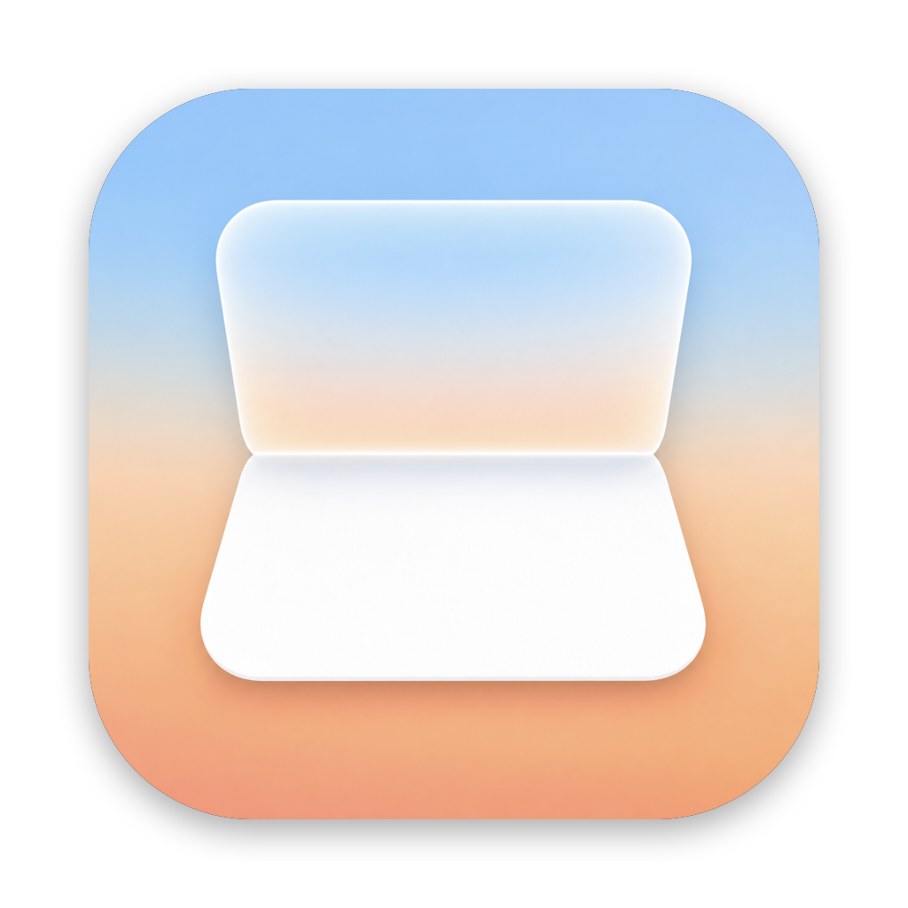

<div align="center">



# Mac Duo

**Close the lid. The desktop stays.**

Mac Duo brings the iPhone Duo fold to your MacBook. As the lid comes down, what's on screen holds still in the room and softens into frosted light. Open it, and everything comes back into focus.

[mac-duo.com](https://mac-duo.com) · [Download](https://github.com/ninobc/mac-duo/releases/latest) · [Privacy](https://mac-duo.com/privacy)

</div>

---

## What it does

- **The picture holds still.** At the start angle the desktop is frozen where it is in the room. Every glass pixel then shows what a fixed eye would see of that picture through the tilting lid (a fixed front-view re-projection, the same construction as the iPhone Duo transition).
- **Frost from the far edge.** Blur and darkness follow the picture's height above the hinge. Colour leaks past the picture's edges; a faint sheen crosses the glass mid-fold; grain keeps the gradient clean.
- **One curve, both ways.** Nothing is a canned animation. The hinge angle is read ~100×/s and smoothed with a critically damped spring; opening plays the same curve back. Stop halfway and it waits.
- **Focus on wake.** Optionally, the desktop comes back into focus from frost after the Mac wakes.
- **Three looks** (Duo, Soft, Cinematic) plus every knob in Settings, including a scrub slider that folds the real screen while you drag.

Runs as a menu bar app. Requires macOS 14 or later and a MacBook with a lid angle sensor (14/16-inch MacBook Pro from 2021, the 2019 16-inch, MacBook Air M2 and later). Screen Recording permission is needed to see the desktop; nothing is stored or sent anywhere.

## Install

Download `Mac-Duo.dmg` from the [latest release](https://github.com/ninobc/mac-duo/releases/latest) and drag Mac Duo to Applications.

Mac Duo is not yet notarized with Apple, so the first launch shows **"Mac Duo" Not Opened**. That dialog means macOS could not check the signature against Apple's servers, not that anything was found. To open it once:

1. Click **Done** (not Move to Trash).
2. Open **System Settings › Privacy & Security**, scroll to the bottom, and click **Open Anyway** next to Mac Duo.
3. Confirm in the dialog that follows. macOS remembers the choice.

Or, from Terminal:

```sh
xattr -dr com.apple.quarantine "/Applications/Mac Duo.app"
```

Then allow Screen Recording when asked. Nothing is stored or sent anywhere; the [privacy statement](https://mac-duo.com/privacy) has the details.

## Build

Xcode 16 or later (Swift 6 toolchain).

```sh
Scripts/build.sh --run          # release build, ad-hoc signed, launched
Scripts/build.sh --universal    # Apple silicon + Intel
swift test                      # unit tests for the maths and state machine
```

The app is a plain Swift package with no dependencies:

| Target | What |
|---|---|
| `DuoCore` | Geometry, curves, spring, angle tracker, fold state machine, presets. Pure and tested. |
| `DuoRender` | The Metal renderer and shader. Still and live pictures, Gaussian pyramid, offscreen rendering. |
| `LidAngle` | The hinge angle over IOKit HID. |
| `MacDuo` | The app: capture (ScreenCaptureKit), overlay window, controller, menu bar, settings, onboarding. |
| `duofold` | CLI that renders the fold on an image, for QA and marketing frames. |
| `lidprobe` | CLI that prints the hinge angle. |

Useful while developing:

```sh
Scripts/duoctl preview          # play the fold on a running app
Scripts/duoctl scrub 60         # hold the fold at 60°; `duoctl release` lets go
Scripts/duoctl log 5m           # the app's log
.build/debug/duofold in.png out.png --angle 60 --preset cinematic
```

## Release

```sh
SIGN_IDENTITY="Developer ID Application: …" NOTARY_PROFILE=macduo Scripts/release.sh 1.0.0
```

Builds universal, signs, packages `dist/Mac-Duo-1.0.0.dmg` and `.zip`, and notarizes when a profile is given. Tagging `v1.0.0` runs the same in GitHub Actions and publishes a release. The website lives in its own repository, [mac-duo-site](https://github.com/ninobc/mac-duo-site); its `public/updates.json` is the feed the app polls once a day.

## How the fold is built

See [docs/EFFECT.md](docs/EFFECT.md) for the geometry and the shader, and [docs/PRODUCT.md](docs/PRODUCT.md) for the product spec.

## Acknowledgements

The lid angle sensor's HID interface was first documented by [Sam Henri Gold](https://github.com/samhenrigold/LidAngleSensor). Mac Duo is an independent project inspired by Apple's iPhone Duo; iPhone, MacBook and macOS are trademarks of Apple Inc.

## License

MIT © 2026 Nino Bouchedid
